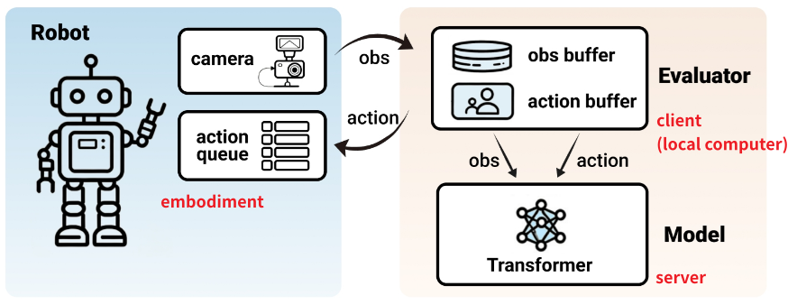

该仓库基于Lerobot实现了统一的机器人部署流程，只需实现固定的接口即可将任意策略模型部署到任意机器人上。


## 环境准备
安装lerobot环境：
```sh
git clone git@github.com:huggingface/lerobot.git
cd lerobot
pip install -e .
```

## 部署流程

真机部署策略模型的整体流程大致如下：

<div style="text-align: center;">
    
</div>

运行流程可以理解为：

- 启智平台运行policy model server，实时接收观测（obs）以及机器人状态（state），并返回推理的动作（action chunk）；（server的url可以被平台的在线vscode转发到本地访问）
- 本地运行一个client，作为中转站：
    1. client实时接收robot相机信号以及机器人状态等数据，通过url将数据格式化并打包发送给server；
    2. server接收数据，运行模型forward，返回动作给client；
    3. client接收到动作并格式化，打包发送给robot；
    4. robot执行动作，得到新的观测，然后返回第1步。

因此这个过程中需要实现三个关键：**启智平台的policy model server**，**本地的client**，**本地与机器人交互的robot**

### Policy model server
可以参考[X-VLA](https://github.com/2toinf/X-VLA/blob/main/deploy.py)中的实现，简单来说就是开一个接收数据的端口，接收到来自client发送的数据，进行推理并返回action chunk。


### Client
实现可以参考`src/policies/xvla`，该部分主要负责格式化数据，包括将接收到的robot数据格式化发送server，然后将server数据格式化发送robot。提供了最小实现的`src/policies/template`。


### Robot
实现可以参考`src/robots/g1`，该部分与机器人本体进行交互，通过调用机器人sdk等方式获取机器人本体的状态，以及控制机器人运动。提供了最小实现的`src/robots/template`。


## XVLA部署G1实现
目前仓库已经实现了将XVLA部署到G1中，实际部署流程如下：

1. 在启智平台运行XVLA deploy.py，命令如下：
    ```sh
    python -m deploy \
        --model_path 2toINF/X-VLA-pt \
        --port 8000
    ```
    将vscode转发的url贴到run.sh中

2. 本地连接G1，参考`8_智元精灵G01 GDK v1.5.0版使用指南-0710.pdf`连接G1，配置IP，安装相关依赖，安装SDK。

3. 本地运行client与server进行交互：
    ```sh
    bash run.sh
    ```